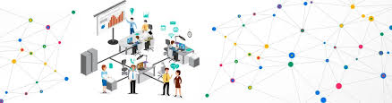

# Redes de Computadores

Nessa disciplina foram abordadas assunstos como História e evolução das redes de computadores. Modelos de referência OSI e TCP/IP: camadas e arquitetura. Projeto de redes. Tecnologias de redes móveis e redes sem fio.

