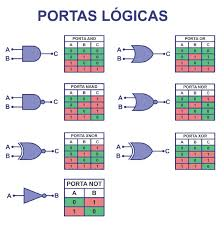

# Sistemas Digitais

Nessa disciplina foram abordados assuntos como Funções lógicas. Postulados e teoremas da álgebra de Boole. Circuitos combinacionais e sequenciais. Análise e síntese de circuitos digitais. Conversores digital-analógico e analógico-digital. Circuito multiplex e demultiplex. Flip-flops e dispositivos correlatos.

